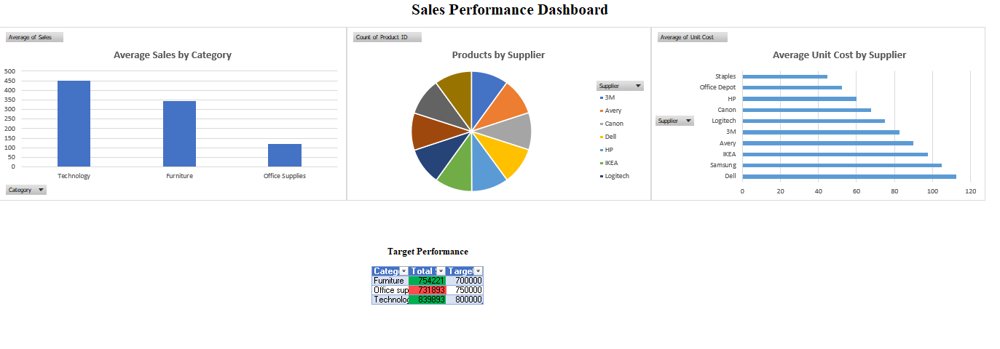

# Excel Sales Analysis Project

## Project Overview

This project was completed using Microsoft Excel to analyze sales data and build an interactive business dashboard. The project covers the complete data analysis process, including data cleaning, Pivot Tables, lookup functions, calculated fields, and dashboard creation to transform raw sales data into meaningful business insights.

---

## Dashboard Preview

---

## Tools Used

- Microsoft Excel
- Pivot Tables
- Pivot Charts
- XLOOKUP
- SUMIFS
- COUNTIFS
- IF / IFS
- Conditional Formatting

---

## Dataset

The project uses a sales dataset containing information about orders, customers, products, suppliers, regions, returns, and sales performance. The dataset was cleaned, transformed, and analyzed to build an interactive dashboard for business reporting.

---

## Project Structure

### Checkpoint 1 – Data Cleaning

- Removed duplicate records
- Standardized data formats
- Formatted dates and numeric values
- Converted the dataset into Excel Tables

### Checkpoint 2 – Pivot Tables

- Created Pivot Tables to answer business questions
- Used different aggregation methods (SUM, AVERAGE, and COUNT)
- Organized Pivot Tables for clear analysis

### Checkpoint 3 – Lookup Functions

- Used XLOOKUP to retrieve related information
- Combined data from multiple tables
- Verified lookup results

### Checkpoint 4 – Calculated Fields

- Created Profit Status using IF
- Created Margin Level using IFS
- Used SUMIFS and COUNTIFS for business calculations

### Checkpoint 5 – Dashboard Design

- Built an interactive Excel dashboard
- Added Pivot Charts
- Applied Conditional Formatting
- Organized visuals into a clean and structured layout

### Checkpoint 6 – Documentation

- Documented the formulas and functions used
- Explained the purpose of each analysis step

---

## Key Features

- Data Cleaning
- Pivot Tables
- Pivot Charts
- Dashboard Design
- XLOOKUP
- SUMIFS
- COUNTIFS
- IF / IFS
- Conditional Formatting
- Business Analysis

---

## Repository Contents

- `superstore_raw_data.xlsx`
- `Screenshots/`
- `README.md`

---

## Dashboard Highlights

The dashboard provides an interactive overview of sales performance through Pivot Charts and summary metrics. Users can analyze sales by category, supplier, customer segment, and region while exploring the data through a clean and organized dashboard layout.

---

## Project Outcome

This project demonstrates practical Microsoft Excel skills in data cleaning, business analysis, dashboard development, and reporting. The completed checkpoints showcase the ability to transform raw sales data into clear and meaningful business insights using Excel's analytical tools.
